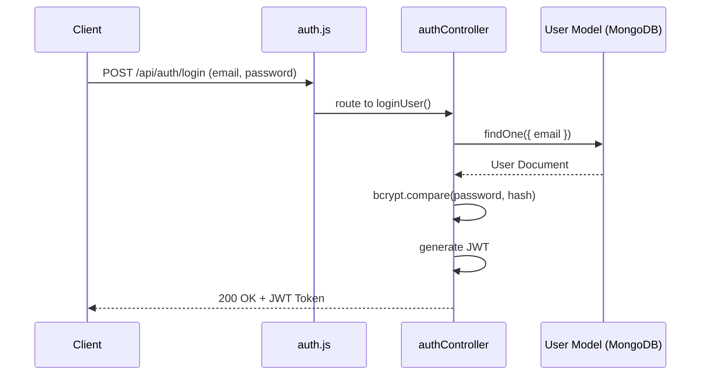

# Module 1: Backend Foundation & Authentication

## 1. Purpose and Problem Solved
Almost every web application needs a way to identify users and restrict access to certain resources. This module establishes the core backend server (using Express.js), connects it to a persistent database (MongoDB), and implements secure user registration and login. The problem solved is stateless authentication: verifying user identity without storing session state on the server, which is crucial for scalability.

## 2. Architecture Decisions
- **Express.js framework**: Chosen for its minimal overhead and unopinionated nature, allowing for flexible routing and middleware integration.
- **MongoDB + Mongoose**: A NoSQL database is ideal for a fast-evolving catalog of products. Mongoose provides schema validation over MongoDB's schema-less nature.
- **JWT (JSON Web Tokens)**: We chose stateless authentication. Instead of server-side sessions, the server issues a signed JWT. The client sends this token with every request.
- **Bcrypt**: Used for hashing passwords before saving them to the database. We never store plain-text passwords.

## 3. Referenced Files
- `backend/server.js` (Assumed entry point)
- `backend/models/User.js`
- `backend/controllers/authController.js`
- `backend/routes/auth.js`
- `backend/middleware/authMiddleware.js` (Assumed)

## 4. File Explanations

### `backend/models/User.js`
- **Why it exists**: To define the structure and validation rules for user data in MongoDB.
- **Why it belongs here**: The `models` directory isolates data definition from business logic.
- **Responsibilities**: Defines fields (name, email, password), schema constraints (unique email), and may contain pre-save hooks to hash the password before inserting into the DB.
- **Interactions**: Used by `authController.js` to create or query users.

### `backend/controllers/authController.js`
- **Why it exists**: To hold the business logic for authentication.
- **Why it belongs here**: Keeps routes clean and delegates the "how" to controllers.
- **Responsibilities**: Extracts data from `req.body`, interacts with `User.js`, hashes passwords, compares passwords, generates JWTs, and sends HTTP responses.
- **Interactions**: Receives requests from `auth.js` routes, queries `User.js`, uses `bcryptjs` and `jsonwebtoken`.

### `backend/routes/auth.js`
- **Why it exists**: Maps URL paths (e.g., `/api/auth/login`) to controller functions.
- **Responsibilities**: Defines POST routes for registration and login.
- **Interactions**: Bound to the main Express app in `server.js` and calls functions in `authController.js`.

## 5. Request Flow (Login Flow)
1. Client POSTs email/password to `/api/auth/login`.
2. `auth.js` routes the request to `loginUser` in `authController.js`.
3. Controller uses `User.findOne({ email })`.
4. If found, it uses `bcrypt.compare()` to match the hashed password.
5. If match, `jwt.sign()` generates a token with the user's ID.
6. The controller responds with `200 OK`, the token, and basic user data.

## 6. Sequence Diagram

## 7. Important Libraries
- **express**: Core routing. Alternative: Fastify (faster, but smaller ecosystem).
- **mongoose**: ODM for MongoDB. Alternative: Native MongoDB driver (more control, less structure).
- **bcryptjs**: Password hashing. Alternative: Argon2 (more secure, harder to set up).
- **jsonwebtoken**: Standard for stateless auth. Alternative: Passport.js (if dealing with OAuth/Sessions).

## 8. Development Insights
- **Common Mistakes**: Storing JWTs in `localStorage` without XSS protection considerations; forgetting to `await` bcrypt functions.
- **Debugging Tips**: If passwords don't match, ensure you aren't re-hashing an already hashed password on updates.
- **Interview Questions**: "Explain the difference between JWT and Session-based auth." "How do you securely store passwords?"
- **Scaling Considerations**: JWTs scale infinitely since the server stores no session data.
- **Production Considerations**: Store JWT secrets in environment variables (`.env`). Use short expiration times for tokens.

## 9. Prerequisites
- Basic JavaScript (ES6)
- Understanding of HTTP methods (GET, POST)
- Basic Terminal/Command Line usage

## 10. Rebuild From Scratch Checklist
- [ ] Initialize Node project (`npm init -y`)
- [ ] Install express, mongoose, dotenv, cors, bcryptjs, jsonwebtoken
- [ ] Create basic Express server listening on port 5000
- [ ] Connect to MongoDB using Mongoose
- [ ] Define the User Schema and Model
- [ ] Implement Registration logic (hashing password)
- [ ] Implement Login logic (comparing password, generating JWT)
- [ ] (Optional) Implement auth middleware to verify JWT

## 11. Exercises
- **Beginner**: Add a new field to the User model, like `phoneNumber`, and require it during registration.
- **Intermediate**: Implement an endpoint that returns the current logged-in user's profile based on the JWT token.
- **Advanced**: Implement Refresh Tokens to securely extend user sessions without requiring them to log in constantly.

[Next Module: Products & Orders](./02-products-orders.md)
