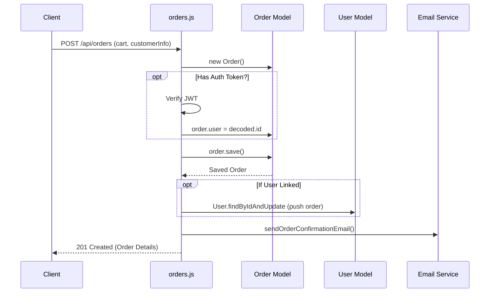

# Module 2: Products & Orders

## 1. Purpose and Problem Solved
An e-commerce platform needs a catalog of products for users to view and a way to record transactions (orders). This module handles the core business data. It provides APIs to fetch the list of gifts, fetch details of a single gift, and create/view orders linking a user to the items they purchased.

## 2. Architecture Decisions
- **NoSQL Data Modeling**: Since gifts might have varying attributes, MongoDB's flexible schema is helpful.
- **Referencing vs Embedding**: In `Order.js`, the items array embeds references to `Gift` (`giftId: ObjectId`) but also duplicates essential data (`name`, `basePrice`). This is a standard NoSQL pattern known as "snapshotting". If a gift's price changes in the future, it shouldn't alter the price in historical orders.
- **RESTful Endpoints**: Standard HTTP verbs map to CRUD operations (`GET /api/gifts`, `POST /api/orders`).

## 3. Referenced Files
- `backend/models/Gift.js`
- `backend/models/Order.js`
- `backend/routes/gifts.js`
- `backend/routes/orders.js`

## 4. File Explanations

### `backend/models/Gift.js`
- **Why it exists**: Defines the schema for products (title, description, price, category, imageUrl).
- **Responsibilities**: Enforces types and requirements for product entries.
- **Interactions**: Used by `gifts.js` routes to query the database.

### `backend/models/Order.js`
- **Why it exists**: Defines the schema for a customer's purchase.
- **Why it belongs here**: Essential part of the data model.
- **Responsibilities**: Stores customer info, an array of ordered items, total price, payment status, and order status. It also contains an optional reference to the `User` who made the order.
- **Interactions**: Created when the user checks out. Used by `orders.js`.

### `backend/routes/gifts.js`
- **Why it exists**: Provides API endpoints for the frontend to fetch the catalog.
- **Responsibilities**: Handles `GET /` (with category filters), `GET /:id`, and admin endpoints (`POST`, `PUT`, `DELETE`).
- **Interactions**: Queries the `Gift` model and returns JSON to the client.

### `backend/routes/orders.js`
- **Why it exists**: Handles order creation and retrieval.
- **Responsibilities**: Handles `POST /` to create an order. It dynamically checks for a JWT token; if present, it links the order to the authenticated user. It also sends an email confirmation.
- **Interactions**: Interacts with `Order.js`, `User.js` (to update user's order history), and `utils/emailService.js`.

## 5. Request Flow (Order Creation)
1. Client POSTs cart data and customer info to `/api/orders`.
2. `orders.js` router receives the payload.
3. It validates the presence of required fields (`customerInfo`, `items`, `totalPrice`).
4. It creates a new `Order` document in memory.
5. It checks the `Authorization` header. If a valid JWT is found, it extracts the user ID and attaches it to the order.
6. The order is saved to MongoDB.
7. If linked to a user, the user's `orders` array is updated.
8. An email confirmation is triggered asynchronously.
9. Responds with `201 Created` and the order details.

## 6. Sequence Diagram

## 7. Important Libraries
- **mongoose**: Used heavily here for `.populate()` which replaces the `giftId` in the order items with the actual Gift document data when querying.

## 8. Development Insights
- **Common Mistakes**: Not capturing the product price at the time of order creation. If you only store `giftId` and fetch the price dynamically later, past orders will look like they cost the *current* price of the item.
- **Debugging Tips**: When using `.populate()`, ensure the `ref` string in your schema exactly matches the model name.
- **Interview Questions**: "Explain the difference between referencing and embedding in NoSQL." "How do you handle transactional data like orders in a non-relational database?"

## 9. Prerequisites
- Module 1 (Authentication)
- Understanding of JSON and HTTP Status Codes.

## 10. Rebuild From Scratch Checklist
- [ ] Define `Gift` Schema (title, price, category, etc.)
- [ ] Define `Order` Schema (customerInfo, items array with snapshotted prices, total, status)
- [ ] Create `GET /api/gifts` endpoint with optional query filters.
- [ ] Create `GET /api/gifts/:id` endpoint.
- [ ] Create `POST /api/orders` endpoint that handles both guest and authenticated users.
- [ ] Create `GET /api/orders/:id` to fetch an order.

## 11. Exercises
- **Beginner**: Add an endpoint to fetch gifts that are marked as "popular" (`popular: true`).
- **Intermediate**: Add stock management. When an order is created, decrement the `stockQuantity` of the purchased gifts. Prevent order creation if stock is insufficient.
- **Advanced**: Implement an admin dashboard endpoint that aggregates sales data (e.g., total revenue per day using MongoDB Aggregation Pipeline).

[Previous Module](./01-backend-foundation-authentication.md) | [Next Module: Payment Gateway](./03-payment-gateway.md)
