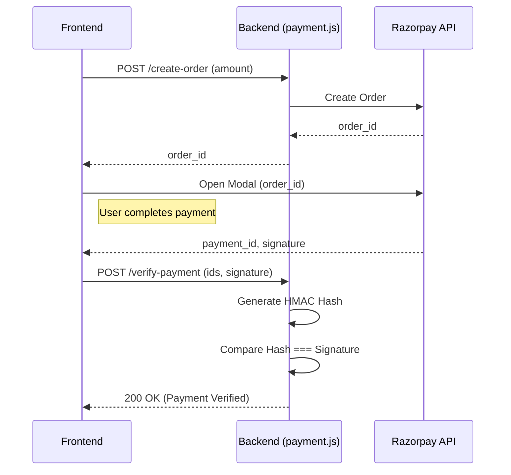

# Module 3: Payment Gateway Integration

## 1. Purpose and Problem Solved
To process real transactions, an e-commerce platform needs a payment gateway. Handling raw credit card data requires strict PCI-DSS compliance, which is difficult. Instead, we use Razorpay as a third-party payment processor. This module safely generates payment intents and cryptographically verifies successful payments to prevent fraud.

## 2. Architecture Decisions
- **Two-Step Verification**: 
  1. The backend creates an Order ID with Razorpay securely.
  2. The frontend uses this Order ID to open the payment modal.
  3. Upon success, Razorpay gives the frontend a signature.
  4. The frontend sends this signature to our backend to verify via HMAC SHA256 before marking the order as "Paid". This prevents malicious users from simply sending a `status: paid` API request.

## 3. Referenced Files
- `backend/routes/payment.js`

## 4. File Explanations

### `backend/routes/payment.js`
- **Why it exists**: To isolate all third-party payment logic from our internal application logic.
- **Responsibilities**: 
  - Initializes the Razorpay instance with `RAZORPAY_KEY_ID` and `RAZORPAY_SECRET`.
  - Exposes an endpoint to create a Razorpay order.
  - Exposes an endpoint to verify the payment signature.
- **Interactions**: Interacts with the Razorpay API over the internet.

## 5. Request Flow (Payment Flow)
1. User clicks "Pay Now". Frontend calculates total (e.g., ₹500).
2. Frontend POSTs to `/api/payment/create-order` with the amount.
3. Backend calls `razorpay.orders.create({ amount: 50000 })` (in paise/cents).
4. Razorpay returns an `id` (e.g., `order_XYZ`). Backend sends this to frontend.
5. Frontend injects the Razorpay script and opens the checkout modal using `order_XYZ`.
6. User enters card details and pays.
7. Razorpay returns `razorpay_payment_id`, `razorpay_order_id`, and `razorpay_signature` to the frontend.
8. Frontend POSTs these three values to `/api/payment/verify-payment`.
9. Backend uses the `crypto` library to hash `order_id + "|" + payment_id` using the Razorpay Secret.
10. Backend compares the generated hash with the `razorpay_signature`. If they match, payment is legitimate.

## 6. Sequence Diagram

## 7. Important Libraries
- **razorpay**: Official Node.js SDK for Razorpay. Alternatives: Stripe, PayPal.
- **crypto**: Built-in Node.js library used for generating the HMAC hash.

## 8. Development Insights
- **Common Mistakes**: Passing amounts to Razorpay in Rupees instead of Paise (e.g., passing 500 instead of 50000). The transaction will be for ₹5 instead of ₹500.
- **Debugging Tips**: If signature verification fails, ensure you are using the EXACT string format specified in the docs: `order_id + "|" + payment_id`. Any deviation will result in a completely different hash.
- **Production Considerations**: Never expose your `RAZORPAY_SECRET` to the frontend. Ensure all verification happens on your server. Consider implementing Razorpay Webhooks as a fallback in case the user's internet drops right after paying but before the frontend can call `/verify-payment`.

## 9. Prerequisites
- Module 2 (Orders)
- A free Razorpay test account.

## 10. Rebuild From Scratch Checklist
- [ ] Get Test API keys from Razorpay Dashboard.
- [ ] Install `razorpay` npm package.
- [ ] Create `/create-order` POST endpoint to generate an order ID.
- [ ] Create `/verify-payment` POST endpoint using Node `crypto` to verify the HMAC SHA256 signature.

## 11. Exercises
- **Beginner**: Modify the `/create-order` endpoint to accept an order receipt string (e.g., your internal database order ID) and pass it to Razorpay for easier reconciliation.
- **Intermediate**: In the `/verify-payment` endpoint, after successful verification, automatically update your internal `Order.js` document's `paymentStatus` to 'completed'.
- **Advanced**: Implement a Razorpay Webhook endpoint that listens for the `payment.captured` event to handle cases where the user closes the browser before the frontend finishes the flow.

[Previous Module](./02-products-orders.md) | [Next Module: Frontend Foundation](./04-frontend-foundation-routing.md)
