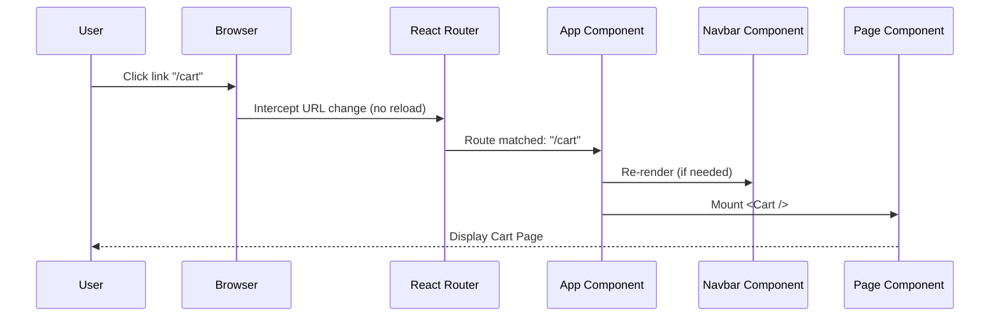

# Module 4: Frontend Foundation & Routing

## 1. Purpose and Problem Solved
Traditional multi-page applications reload the entire browser window when navigating. Modern web apps use Single Page Application (SPA) architecture for a native-app-like experience. This module sets up React, a build tool (Vite), styling (Tailwind CSS), and client-side routing so users can navigate between the Home, Catalog, and Login pages instantly without full page reloads.

## 2. Architecture Decisions
- **React & Vite**: React is the standard for component-based UI. Vite is chosen over Create React App (CRA) for its drastically faster Hot Module Replacement (HMR) and build times.
- **Tailwind CSS**: Utility-first CSS allows for rapid UI development without context switching between CSS files and JSX.
- **React Router**: The industry standard for declarative routing in React.
- **Component-Based Design**: The UI is broken into reusable pieces (e.g., `Navbar`, `Footer`, `ProductCard`).

## 3. Referenced Files
- `src/main.jsx`
- `src/App.jsx`
- `src/index.css`
- `src/pages/Index.jsx`
- `src/components/Navbar.jsx` (Assumed)

## 4. File Explanations

### `src/main.jsx`
- **Why it exists**: The entry point of the React application.
- **Responsibilities**: Grabs the root HTML element (`id="root"`) and injects the React tree into it using `ReactDOM.createRoot`.
- **Interactions**: Renders the `<App />` component.

### `src/App.jsx`
- **Why it exists**: The root component that defines the overall layout and routing structure.
- **Responsibilities**: Sets up the `BrowserRouter`, defines the `Routes` (mapping URL paths to page components), and places persistent elements like `<Navbar />` outside the `Routes` so they stay visible during navigation.
- **Interactions**: Uses components from the `pages/` directory.

### `src/pages/Index.jsx`
- **Why it exists**: Represents the Home page.
- **Why it belongs here**: Grouping top-level route components in a `pages/` directory keeps them separate from reusable UI `components/`.

### `src/index.css`
- **Why it exists**: The global stylesheet.
- **Responsibilities**: Imports Tailwind directives (`@tailwind base; @tailwind components; @tailwind utilities;`) and defines global CSS variables (like theme colors).

## 5. Request Flow (Routing Flow)
1. User types `http://localhost:5173/catalog` in the browser.
2. The server (Vite dev server) returns `index.html`.
3. `main.jsx` executes, mounting the React app.
4. `React Router` inside `App.jsx` reads the current browser URL (`/catalog`).
5. It finds the `<Route path="/catalog" element={<Catalog />} />` match.
6. The `<Catalog />` component is rendered inside the layout, while the `<Navbar />` remains unchanged.

## 6. Sequence Diagram

## 7. Important Libraries
- **react-router-dom**: Handles client-side navigation. Alternatives: TanStack Router, Next.js (framework).
- **tailwindcss**: Utility styling. Alternatives: Styled-components, CSS Modules.
- **lucide-react**: Clean, consistent icon set. Alternatives: FontAwesome, React Icons.

## 8. Development Insights
- **Common Mistakes**: Using `<a href="/catalog">` instead of React Router's `<Link to="/catalog">`. An `<a>` tag will cause a full page reload, breaking the SPA experience and wiping out non-persisted React state.
- **Interview Questions**: "What is a Single Page Application?" "How does the Virtual DOM work in React?"
- **Production Considerations**: When deploying an SPA, you must configure the web server (like Nginx or Vercel) to redirect all 404 requests to `index.html` so React Router can handle the routing.

## 9. Prerequisites
- Basic HTML, CSS, and modern JavaScript (ES6+).
- Node.js installed.

## 10. Rebuild From Scratch Checklist
- [ ] Scaffold project: `npm create vite@latest my-app -- --template react`
- [ ] Install and configure Tailwind CSS (`tailwind.config.js`, `index.css`).
- [ ] Install `react-router-dom`.
- [ ] Create `pages/` directory with dummy `Home`, `Catalog`, and `Cart` components.
- [ ] Set up `<BrowserRouter>` and `<Routes>` in `App.jsx`.
- [ ] Build a `<Navbar>` component with `<Link>` tags to navigate between pages.

## 11. Exercises
- **Beginner**: Add a "Not Found" (`404`) page that renders when the user navigates to a URL that doesn't match any route (hint: `<Route path="*" />`).
- **Intermediate**: Implement nested routing where `/profile` shows a layout, and `/profile/settings` and `/profile/orders` show different sub-pages within that layout.
- **Advanced**: Implement route-level code splitting using `React.lazy()` and `<Suspense>` so the code for the Checkout page is only downloaded when the user actually navigates there.

[Previous Module](./03-payment-gateway.md) | [Next Module: Global State Management](./05-global-state-management.md)
