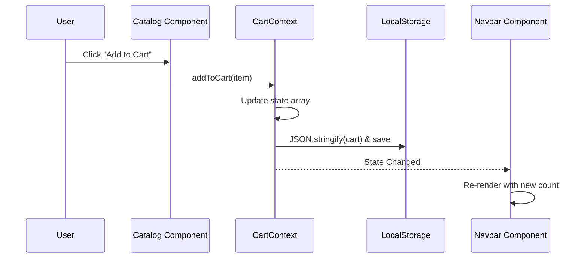

# Module 5: Global State Management

## 1. Purpose and Problem Solved
In React, state usually flows downwards via props. If the `Navbar` needs to know how many items are in the cart (managed in the `Catalog` page), you run into "prop drilling" (passing props through many intermediate components). Global state management solves this by creating a central store accessible by any component. We need this for the User's authentication session and the Shopping Cart.

## 2. Architecture Decisions
- **React Context API**: Since our global state needs (Cart and Auth) are relatively simple, Redux is overkill. The native Context API, combined with `useReducer` or `useState`, provides a clean, built-in solution.
- **Local Storage Persistence**: When the user refreshes the page, React state resets. We sync our Context state to `localStorage` so the user doesn't get logged out and doesn't lose their cart items on refresh.

## 3. Referenced Files
- `src/contexts/AuthContext.jsx`
- `src/contexts/CartContext.jsx`
- `src/pages/Login.jsx`

## 4. File Explanations

### `src/contexts/AuthContext.jsx`
- **Why it exists**: To hold the currently logged-in user data and JWT token globally.
- **Responsibilities**: Exposes state (`user`, `token`) and actions (`login`, `logout`). On initialization, it checks `localStorage` for a saved token to automatically log the user back in.
- **Interactions**: Wraps the `<App />` so any component can use `useContext(AuthContext)`.

### `src/contexts/CartContext.jsx`
- **Why it exists**: To hold the array of items the user intends to purchase.
- **Responsibilities**: Provides functions like `addToCart()`, `removeFromCart()`, `updateQuantity()`, and `clearCart()`. Calculates the total price.
- **Interactions**: The `Navbar` reads this to show the cart badge number. The `Catalog` calls `addToCart`. The `Cart` page reads the items and calls `removeFromCart`.

### `src/pages/Login.jsx`
- **Why it exists**: The UI for users to enter credentials.
- **Responsibilities**: Captures email/password, sends a POST request to the backend. On success, it receives the JWT, calls `login(token, user)` from `AuthContext`, and redirects the user.

## 5. Request Flow (Add to Cart Flow)
1. User clicks "Add to Cart" on a product in `Catalog.jsx`.
2. `Catalog.jsx` calls `addToCart(product)` provided by `useContext(CartContext)`.
3. `CartContext` updates its internal state array. If the item exists, it increments the quantity; otherwise, it pushes a new item.
4. `CartContext` executes a `useEffect` that strings the new cart state and saves it to `localStorage`.
5. The state update triggers a re-render of all components consuming `CartContext`.
6. The `Navbar` component re-renders, displaying the updated item count in the badge.

## 6. Sequence Diagram

## 7. Important Libraries
- **React (createContext, useContext, useReducer)**: Built-in tools. Alternatives: Redux Toolkit (for massive apps), Zustand (simpler API), Jotai.

## 8. Development Insights
- **Common Mistakes**: Storing complex, rapidly changing state in Context. Context re-renders *all* consuming components whenever the value changes. It's meant for low-frequency updates (like theme, auth, or cart).
- **Debugging Tips**: If state isn't persisting on refresh, check if your `useEffect` that reads from `localStorage` is running *before* the initial render. (Usually, you pass a function to `useState` to read local storage synchronously on mount).
- **Interview Questions**: "When would you use Context API vs Redux?" "What is prop drilling and how do you avoid it?"

## 9. Prerequisites
- Module 4 (React Routing)
- Deep understanding of React Hooks (`useState`, `useEffect`).

## 10. Rebuild From Scratch Checklist
- [ ] Create `AuthContext.jsx`.
- [ ] Define `AuthProvider` component with `user`, `login`, and `logout` state.
- [ ] Wrap `<App />` with `<AuthProvider>`.
- [ ] Implement `Login.jsx` to consume the context on successful API call.
- [ ] Create `CartContext.jsx`.
- [ ] Implement cart logic (adding, removing, calculating totals).
- [ ] Sync cart state to `localStorage` using a `useEffect`.

## 11. Exercises
- **Beginner**: In the Cart Context, implement a `getCartTotal` function that multiplies price by quantity for all items and returns the grand total. Use this in the Cart UI.
- **Intermediate**: Protect the `/profile` route. Create a `<ProtectedRoute>` wrapper component that checks if `user` exists in `AuthContext`. If not, redirect them to `/login` using `<Navigate to="/login" />`.
- **Advanced**: Migrate the `CartContext` from using `useState` to `useReducer` to handle complex cart logic (like applying discount codes and updating quantities) more cleanly.

[Previous Module](./04-frontend-foundation-routing.md) | [Next Module: Data Fetching & UI Polish](./06-data-fetching-ui-polish.md)
