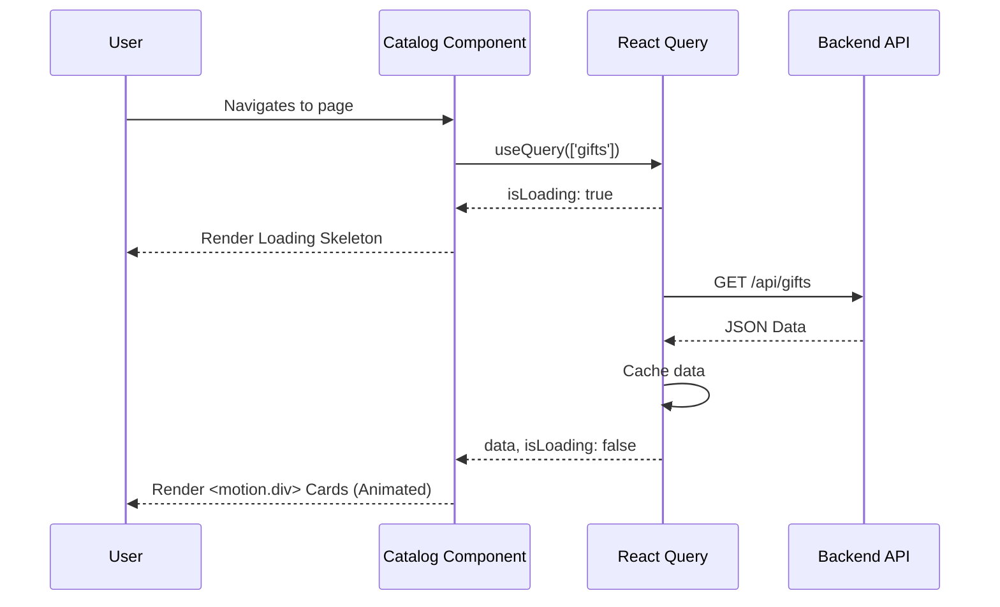

# Module 6: Data Fetching & UI Polish

## 1. Purpose and Problem Solved
Fetching data from an API using `useEffect` and `fetch` involves manually handling loading states, error states, and caching, which leads to bloated components. Furthermore, modern web apps require smooth transitions and immediate feedback to feel premium. This module introduces React Query for robust data fetching and Framer Motion for animations.

## 2. Architecture Decisions
- **React Query**: Standardizes asynchronous state. It caches data, automatically retries failed requests, and provides `isLoading` and `isError` flags out of the box.
- **Framer Motion**: A declarative animation library for React. It makes complex animations (like entering the DOM, hover states) as easy as adding props to a `<motion.div>`.
- **Sonner / Toast notifications**: Used to provide non-intrusive feedback (e.g., "Item added to cart") without using disruptive `alert()` dialogs.

## 3. Referenced Files
- `src/pages/Catalog.jsx`
- `src/pages/Hampers.jsx`

## 4. File Explanations

### `src/pages/Catalog.jsx`
- **Why it exists**: Displays the list of available products fetched from the backend.
- **Responsibilities**: Calls the backend `/api/gifts` endpoint using React Query. Renders a loading skeleton while fetching. Maps over the data to render Product Cards.
- **Interactions**: Dispatches to `CartContext` when a product is selected.

### `src/pages/Hampers.jsx`
- **Why it exists**: A specialized view for a specific category of gifts.
- **Responsibilities**: Similar to Catalog, but fetches data with a category filter.

## 5. Request Flow (Data Fetching Flow)
1. User navigates to `/catalog`.
2. Component mounts. React Query's `useQuery` hook fires.
3. React Query checks its cache. If empty, it sets `isLoading: true`.
4. The fetch function makes a GET request to the backend.
5. While waiting, `Catalog.jsx` renders a skeleton UI.
6. Backend responds with JSON array of products.
7. React Query caches the data and sets `isLoading: false`.
8. `Catalog.jsx` re-renders. The mapping function wraps each product in a `<motion.div>`.
9. Framer Motion animates the cards scaling in smoothly.

## 6. Sequence Diagram

## 7. Important Libraries
- **@tanstack/react-query**: State management for asynchronous operations. Alternatives: SWR, Apollo (for GraphQL), Redux RTK Query.
- **framer-motion**: Animation. Alternatives: React Spring, standard CSS transitions.
- **sonner**: Toast notifications. Alternatives: React Toastify, React Hot Toast.

## 8. Development Insights
- **Common Mistakes**: Leaving out a `key` prop when mapping over data in React. This degrades performance and breaks animations in Framer Motion.
- **Debugging Tips**: Use the React Query Devtools to inspect what data is currently in your cache and manually trigger refetches.
- **Interview Questions**: "What is stale-while-revalidate?" "Why shouldn't you use `useEffect` for all data fetching?"

## 9. Prerequisites
- Module 1-5
- Basic understanding of Promises and `async/await`.

## 10. Rebuild From Scratch Checklist
- [ ] Install `@tanstack/react-query`, `framer-motion`, and `sonner`.
- [ ] Wrap `<App />` in `<QueryClientProvider>`.
- [ ] Refactor `Catalog.jsx` to fetch gifts using `useQuery` instead of `useEffect`.
- [ ] Build a Skeleton loader component to show while `isLoading` is true.
- [ ] Add the `<Toaster />` component to `App.jsx` and trigger a toast in `addToCart()`.
- [ ] Replace standard `
` wrappers on product cards with `<motion.div>` and add `initial`, `animate`, and `whileHover` props.

## 11. Exercises
- **Beginner**: Add a hover animation to your buttons using Framer Motion (`whileHover={{ scale: 1.05 }}`).
- **Intermediate**: Implement category filtering in the `Catalog.jsx`. Pass the selected category as a dependency to your `useQuery` key (e.g., `['gifts', category]`) so React Query automatically refetches when the category changes.
- **Advanced**: Implement an Infinite Scroll or Pagination for the Catalog page using React Query's `useInfiniteQuery`.

[Previous Module](./05-global-state-management.md) | [Next Module: Checkout & Final Assembly](./07-checkout-final-assembly.md)
