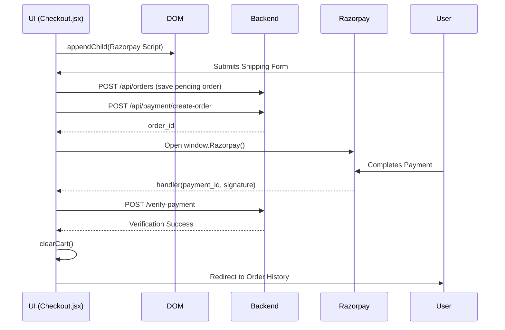

# Module 7: Checkout & Final Assembly

## 1. Purpose and Problem Solved
The culmination of the e-commerce experience is the checkout. This module connects the frontend cart data, user context, and the external Razorpay script to finalize a transaction, subsequently displaying the results in an Order History view.

## 2. Architecture Decisions
- **Dynamic Script Loading**: The Razorpay SDK script (`checkout.js`) is injected into the DOM only when the user visits the Checkout page. This reduces the initial bundle size of the application.
- **Form Validation**: Client-side validation ensures the user provides shipping details before generating an order, saving unnecessary backend calls.

## 3. Referenced Files
- `src/pages/Checkout.jsx`
- `src/pages/OrderHistory.jsx`

## 4. File Explanations

### `src/pages/Checkout.jsx`
- **Why it exists**: To collect shipping info and handle the payment flow.
- **Responsibilities**: 
  - Displays order summary from `CartContext`.
  - Collects address/customer info.
  - Dynamically loads Razorpay script.
  - Calls backend `/create-order` and `/verify-payment`.
  - Clears cart on success and redirects.
- **Interactions**: Highly interactive. Uses `CartContext`, `AuthContext`, contacts the backend, and handles external Razorpay events.

### `src/pages/OrderHistory.jsx`
- **Why it exists**: To show the user their past purchases.
- **Responsibilities**: Fetches the user's past orders from the backend (using the JWT token) and displays them in a list or table.

## 5. Request Flow (Full Checkout Flow)
1. User clicks "Proceed to Checkout" from the Cart.
2. `Checkout.jsx` mounts and dynamically appends `<script src="https://checkout.razorpay.com/v1/checkout.js">` to the document body.
3. User fills in shipping details and clicks "Pay".
4. Frontend POSTs cart data to backend `/api/orders` to save the order record (status: pending).
5. Frontend POSTs to `/api/payment/create-order` to get Razorpay ID.
6. Frontend initializes `new window.Razorpay(options)` passing the ID and a success `handler` callback.
7. Modal opens, user pays.
8. The `handler` callback fires with the signature.
9. Frontend POSTs signature to backend `/api/payment/verify-payment`.
10. If successful, frontend clears `CartContext`, triggers a success Toast, and navigates to `/order-history`.

## 6. Sequence Diagram

## 7. Important Libraries
- No new npm packages; relies heavily on standard DOM API (`document.createElement('script')`) and existing React Router hooks (`useNavigate`).

## 8. Development Insights
- **Common Mistakes**: Trying to call `window.Razorpay` before the script has finished loading. You must await the script load event.
- **Debugging Tips**: If the Razorpay modal doesn't open, check the browser console. Often it's because the `order_id` passed to options is undefined or malformed.
- **Production Considerations**: Validate the cart total on the backend before creating the Razorpay order. Never trust the frontend's price calculation, as malicious users can alter client-side JavaScript.

## 9. Prerequisites
- Module 1-6 fully completed.

## 10. Rebuild From Scratch Checklist
- [ ] Create `Checkout.jsx` page.
- [ ] Build a shipping information form.
- [ ] Write a utility function to dynamically load an external script via Promise.
- [ ] Implement the submission handler: save order to DB, fetch Razorpay ID, open modal.
- [ ] Implement the Razorpay success callback: verify signature, clear cart, redirect.
- [ ] Create `OrderHistory.jsx` page.
- [ ] Fetch and display orders using React Query.

## 11. Exercises
- **Beginner**: Add form validation to the Checkout shipping form (e.g., ensure the ZIP code is exactly 6 digits) before allowing the user to proceed to payment.
- **Intermediate**: Handle the scenario where the Razorpay payment fails or is closed by the user. Show an appropriate error toast and update the backend order status to 'failed'.
- **Advanced**: Implement a PDF receipt generator. When viewing an order in `OrderHistory.jsx`, add a "Download Invoice" button that generates a PDF using a library like `jspdf` or `html2pdf.js`.

[Previous Module](./06-data-fetching-ui-polish.md) | [Back to Home](./README.md)
